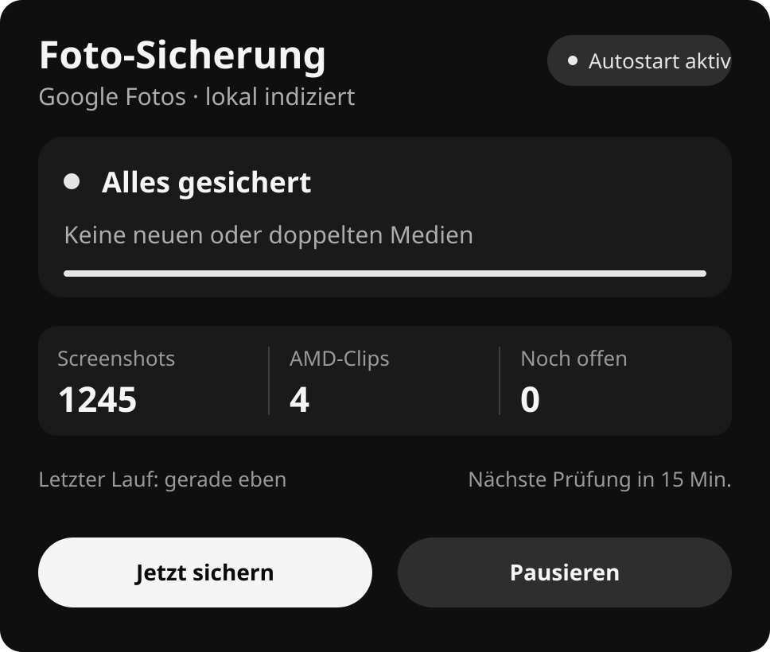
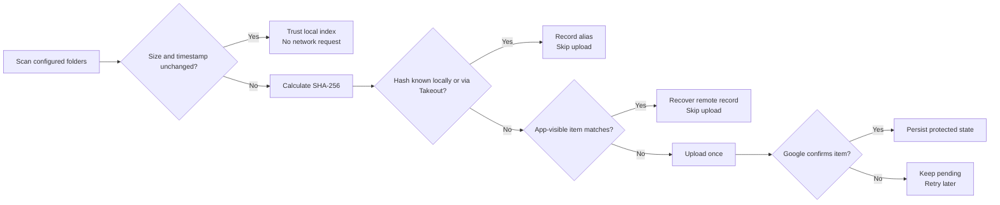

<div align="center">

# Google Photos Sync for Windows

**A tiny native Rust app that backs up photo and video folders without uploading the same content twice.**


**Signed v2 installer: in preparation** · [Homepage](https://henner4746.github.io/google-photos-sync-rs/) · [Privacy](https://henner4746.github.io/google-photos-sync-rs/privacy.html)

</div>



Google Photos Sync stays quietly in the Windows notification area. Its monochrome Material-style interface manages real folders, schedules, exclusions, Takeout import, backups, and updates. It is a single native executable: no Electron bundle, browser runtime, or background service.

## What it does

- **First-run assistant.** Google sign-in, folder selection, the Google Photos limitation, recommended Takeout import, and autostart are handled in the UI.
- **Explicit Google consent.** Immediately before sign-in, the app explains exactly what is uploaded, what it can read, where credentials stay, and that no own server is involved.
- **Hardened desktop sign-in.** Google authorization uses the system browser, a random loopback port, state validation, and per-request PKCE S256 protection.
- **Content-based duplicate protection.** SHA-256 identifies media independently of filename, path, source, or album. A known image or AMD clip is not uploaded again.
- **Google-side recovery.** Content-addressed filenames reconcile media that this same app can see in Google Photos.
- **Takeout protection.** A local Takeout scan records hashes for older Google Photos items the API can no longer expose. Setup warns before proceeding without it, and real uploads stay blocked until Takeout was imported or the user explicitly confirms that no older copies from the selected folders exist.
- **Per-folder controls.** Each folder has its own album, media type, enabled state, schedule, and excluded subfolders.
- **Visible work.** Uploads show file progress and transfer speed; errors produce a Windows notification.
- **Network recovery.** Upload and API calls retry transient failures with backoff. Anything not confirmed remains pending and resumes on the next run.
- **Persistent state.** Paused state, schedules, window position, and last successful runs survive restarts.
- **Local backup and restore.** Settings, the duplicate database, and DPAPI-protected credentials can be backed up from the app.
- **Revocable access.** `Google trennen` revokes the Google token and removes the local encrypted credential without deleting photos.
- **Verified updates.** The updater checks at startup and then daily. No stable release is treated as a normal no-update result. An available update requires the GitHub SHA-256 digest, a trusted Windows Authenticode signature, and the same publisher as the installed app, and is verified again immediately before replacement.
- **Low overhead.** Native Win32 UI, SQLite, four upload streams, and small optimized Rust release builds. The hidden tray app has no permanent animation timer, scans folders lazily at autostart, and repaints only while its window is visible.

The current optimized release executable is about 2.12 MiB. A repeatable 30-second hidden-tray measurement and the safeguards behind it are documented in [Performance](docs/PERFORMANCE.md).

## Install

The supported public installer is not available yet. The older `v1.0.0` and `v1.1.0` releases are unsigned development binaries and are not the finished public product. Their direct downloads are intentionally not promoted. Once OAuth verification and code signing are complete, download the signed `Google-Photos-Sync-Setup.exe`, verify its Windows signature, run it, and follow the first-run assistant. The installer is per-user, adds a clean Windows autostart entry when selected, and provides a normal uninstaller.

Public v2 releases are created only after the release workflow has verified a trusted Windows signature. The workflow supports either a project certificate or the managed open-source signing path described in the [code signing policy](CODE_SIGNING_POLICY.md); it refuses to publish unsigned artifacts.

For development builds without an embedded production OAuth client, the assistant opens a file picker for a Google **Desktop app** OAuth JSON. Public releases embed that JSON at build time through a protected repository secret; it is never committed.

The app detects standard folders only when they exist in the current Windows profile:

- `Pictures\Screenshots` as **Screenshots**
- `Videos\Radeon ReLive` as **AMD-Clips**

No personal drive or user path is stored in the repository. Existing installations keep their own configured folders during upgrades.

## Google Photos limitation since March 2025

The Google Photos Library API lets an app upload new media but only list content created by that same app. It cannot inspect an existing personal library globally. Therefore:

1. Existing media uploaded by an older version using the same OAuth client can be reconciled through the API.
2. Existing media outside that app-visible set requires a one-time Google Takeout import for strong duplicate protection.
3. The Takeout import hashes files locally and uploads nothing.

## Duplicate model



## Data and privacy

Configuration, SQLite index, logs, and protected credentials live under `%LOCALAPPDATA%\GooglePhotosSync` for new installations. OAuth refresh tokens are encrypted with Windows DPAPI for the current Windows account. Backups containing the credential file remain bound to that account and PC context.

The app has no own backend, analytics, advertising, or telemetry. See the [privacy statement](https://henner4746.github.io/google-photos-sync-rs/privacy.html), [terms](https://henner4746.github.io/google-photos-sync-rs/terms.html), and [data-management instructions](https://henner4746.github.io/google-photos-sync-rs/data-management.html).

## Code signing policy

Free code signing provided by [SignPath.io](https://about.signpath.io/), certificate by [SignPath Foundation](https://signpath.org/). Maintainer roles, release approval, privacy guarantees, and verification instructions are documented in the [code signing policy](CODE_SIGNING_POLICY.md).

## Advanced commands

The normal user flow requires no console. These commands remain for diagnostics and automation:

```text
gphotos-sync sync [--dry-run] [--limit <items-per-album>]
gphotos-sync tray [--show] [--no-sync]
gphotos-sync status
gphotos-sync import-takeout <unpacked-takeout-folder>
gphotos-sync authorize <oauth-client.json>
gphotos-sync install
gphotos-sync uninstall
```

## Build

Requirements: Windows 10/11, Rust 1.91 or newer, and the MSVC toolchain.

```powershell
cargo fmt --all --check
cargo clippy --all-targets -- -D warnings
cargo test
cargo build --release
```

To embed the public Desktop OAuth configuration for a release build, set `GPHOTOS_SYNC_OAUTH_CLIENT_JSON` only in the protected build environment. See [the OAuth release checklist](docs/OAUTH_RELEASE_CHECKLIST.md) and [verification handoff](docs/GOOGLE_OAUTH_VERIFICATION.md).

## License

[MIT](LICENSE)
