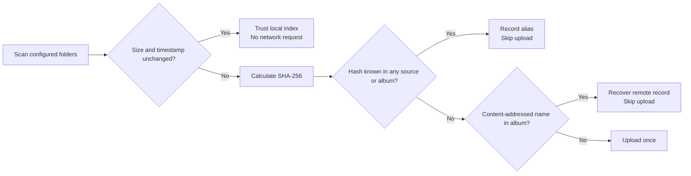

<div align="center">

# Google Photos Sync for Windows

**A tiny native Rust tray app that backs up any folders of photos and videos without uploading the same media twice.**


</div>


Google Photos Sync stays quietly in the Windows notification area. Open the movable monochrome Material-inspired window when you want to manage folders, check the status, run a safe preview, or pause automatic backups. The application is a single native executable: no browser shell, JavaScript runtime, Electron bundle, or background service.

## Why it exists

Google Photos does not provide a desktop folder uploader with content-aware duplicate protection. This app fills that gap for any local folders, including camera imports, artwork, screenshots, and game recordings.

- **Folder management in the app.** Add folders, rename their target albums, open them, or pause each source independently.
- **Content-based deduplication.** SHA-256 identifies media independently of its path, filename, source folder, or target album.
- **Read-only previews.** Test runs show what is pending without uploading media or creating Google Photos albums.
- **No-network fast path.** If size, timestamp, and trusted local state still match, an unchanged run does not call Google at all.
- **Remote reconciliation.** Media visible to the app through the Google Photos API is indexed before new uploads begin.
- **Takeout import.** Hashes from an exported Google Photos library can protect older items that the API no longer exposes to a new app.
- **Safe credentials.** OAuth credentials are encrypted with Windows DPAPI and can only be decrypted by the Windows account that stored them.
- **Low overhead.** Native Win32 UI, SQLite, four parallel upload streams, and serialized `batchCreate` calls of up to 50 items.
- **Keyboard-friendly controls.** The window supports Tab navigation, Enter/Space activation, Escape-to-hide, and tested WCAG AA text contrast.
- **Safe removal semantics.** Removing a source forgets only the folder configuration; it never deletes local files or Google Photos media.

## Install

Download `gphotos-sync.exe` from the latest release or build it locally. In Google Cloud, enable the Google Photos Library API, configure the OAuth consent screen, and download a **Desktop app** OAuth client JSON. Connect it through the browser and install the app:

```powershell
.\gphotos-sync.exe authorize .\client_secret.json
.\gphotos-sync.exe install
Remove-Item .\client_secret.json
```

The browser flow requests only `photoslibrary.appendonly` and `photoslibrary.readonly.appcreateddata`. The resulting refresh token is encrypted locally with DPAPI. `protect-credentials` also exists for migration from another OAuth tool, but normal installations should use `authorize`.

The first run creates `%LOCALAPPDATA%\GooglePhotosSync\gphotos-sync.json`. Folders can be managed directly in the app; the JSON remains available for portable or scripted setups:

```json
{
  "sources": [
    {
      "album": "Screenshots",
      "path": "C:\\Users\\you\\Pictures\\Screenshots",
      "kind": "images",
      "enabled": true
    },
    {
      "album": "AMD-Clips",
      "path": "C:\\Users\\you\\Videos\\Radeon ReLive",
      "kind": "videos",
      "enabled": true
    }
  ]
}
```

`kind` accepts `images`, `videos`, or `all`. Window position and source changes are persisted automatically. Existing version 1.0 configurations are migrated on first save.

`install` copies the current executable into the app data directory and creates a limited-privilege logon task. `uninstall` removes only that task; the database and credentials are preserved intentionally.

## Duplicate model



The local database is the primary index. Upload names include the first 12 characters of the content hash, making remote recovery deterministic. A Takeout import adds hashes only and never uploads anything.

## Commands

```text
gphotos-sync sync [--dry-run] [--limit <items-per-album>]
gphotos-sync tray [--show] [--no-sync]
gphotos-sync status
gphotos-sync import-takeout <unpacked-takeout-folder>
gphotos-sync authorize <oauth-client.json>
gphotos-sync protect-credentials <credentials.json>
gphotos-sync install
gphotos-sync uninstall
```

## Build

Requirements: Windows 10/11, Rust 1.91 or newer, and the MSVC toolchain.

```powershell
cargo fmt --all --check
cargo clippy --all-targets -- -D warnings
cargo test
cargo build --release
```

The optimized executable is written to `target\release\gphotos-sync.exe`.

## Privacy and API limitations

- No credentials, cookies, database files, media, or logs belong in the repository.
- DPAPI protects credentials at rest; it does not hide them from a process running as the same Windows user.
- The Google Photos Library API generally exposes media created by the same API client. For a pre-existing library, import a Google Takeout folder once before the first live sync for the strongest duplicate protection.
- Deleting a local file does not delete its Google Photos copy.

## License

[MIT](LICENSE)
